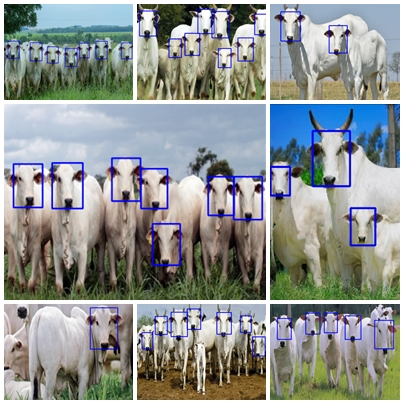
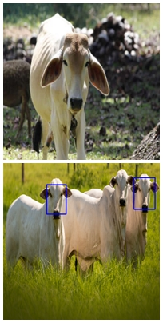

# Detecção Facial Bovina Nelores

Respositório para pesquisa de desenvolvimento para técnica de detecção frontal facial para animais bovinos da raça Nelore.

O melhor classificador, até o momento, apresenta acurácia de 80,77%.

Para utilizá-lo, basta executar o arquivo *face_cow_detect.py*, lozalizado em *./5_validacao/face_cow_detect.py*.

Os módulos de interesse são apenas o 4 e 5, pois contém os dados para treinamento e validação do classificador. Seria inviável colocar os outros módulos, pois o tamanho do repositório ultrapassaria os limites de armazenamento disponibilizado pelo GitHub.

No artigo é explicado a função de cada módulo e seu funcionamento.

### Resultados da detecção

## Módulo de treinamento (4_treinamento)

Este módulo é responsável pelo treinamento do classificador de cascatas Haar. 

É necessário que dentro da pasta rawdata localizada em "4_treinamento/haar_training/training/positive/rawdata" esteja o conjunto de dados para o treinamento do classificador e, no mesmo caminho, esteja o arquivo info.txt responsável por mapear as informações para o treinamento utilizado no opencv_haartraining.

**OBS**.: Todos os comandos a seguir, devem ser executados dentro da pasta *4_treinamento*

Dentro da pasta "haar_trainning/training/":
 1. primeiro executar o arquivo batch samples_creation.bat, responsável por criar o vetor a ser utilizado no treinamento.
 2. Executar o arquivo haarTraining.bat para inicializar o treinamento (para obter resultados diferentes, deve-se alterar os parâmetros)
 3. Após conclusão do treinamento, copiar todo o conteúdo dentro da pasta cascades e colocar dentro da pasta "haar_training/cascade2xml/data", responsável por realizar o merge das features em um arquivo xml ao executar o arquivo batch "convert.bat".
 4. Após a realização dos passos, o classificador foi criado e poderá ser utilzado para a deteção de faces bovinas frontais da raça Nelore.

## Módulo de validacao (5_validacao)

**OBS**.: Todos os comandos a seguir, devem ser executados dentro da pasta *5_validacao*

 - Para obter a detecção dos animais em uma imagem específica, execute:

    `python face_cow_detect.py`

 - Para obter o melhor classificador gerado até o momento, execute o comando:

    `python best_classifier.py`

 - Para obter as métricas de algum classificador específico, execute:

    `python validacao_treinamento.py`
